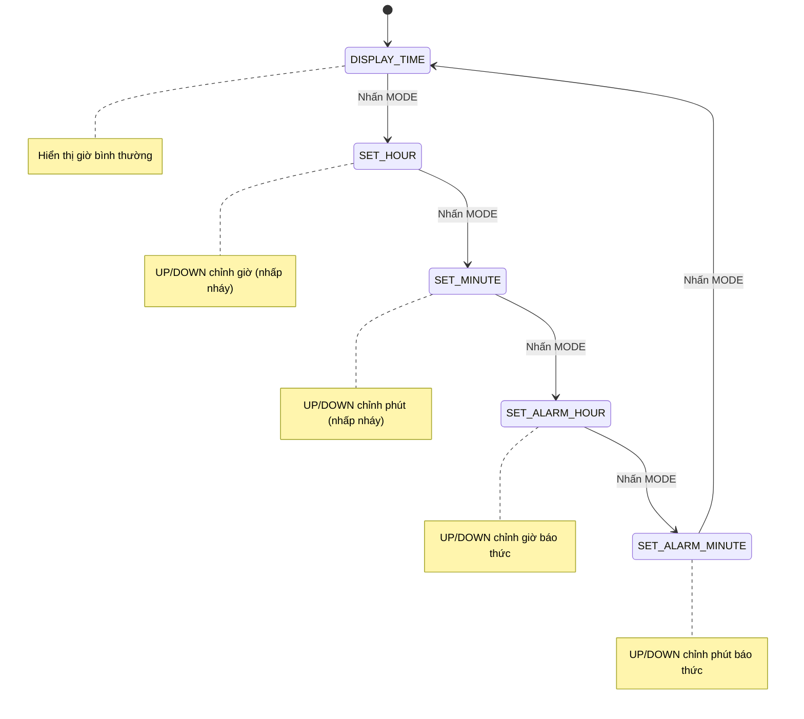

# Kế Hoạch Tối Ưu: Digital Clock - Arduino

## 📋 Phân Tích Kế Hoạch Gốc

### ✅ Điểm tốt
- Danh sách thiết bị đã tối giản hợp lý (LCD I2C, DS3231 chung bus I2C)
- Chia module theo chức năng rõ ràng
- Sử dụng `INPUT_PULLUP` để không cần điện trở ngoài

### ⚠️ Vấn đề cần tối ưu

> [!WARNING]
> **Chia quá nhỏ cho 5 người** — Dự án digital clock khá đơn giản, chia 5 module riêng biệt sẽ tạo ra **overhead tích hợp lớn** (ghép code, xung đột biến, debug liên module) mà công việc mỗi người lại rất ít (chỉ ~20-40 dòng code/người).

> [!WARNING]
> **Người 5 (Buzzer & QA)** — Phần buzzer chỉ cần 1 hàm `tone()` (~5 dòng code), kết hợp với QA thì quá ít việc so với các thành viên khác. Test cases cũng nên là trách nhiệm chung.

> [!IMPORTANT]
> **Thiếu tính năng báo thức hoàn chỉnh** — Kế hoạch gốc chỉ nói "giờ báo thức cố định" nhưng không mô tả cách **đặt/tắt báo thức** bằng nút nhấn, đây là tính năng cốt lõi nếu đã có buzzer.

---

## 🔧 Kế Hoạch Tối Ưu

### Danh sách thiết bị (Giữ nguyên - đã tối giản)

| STT | Thiết bị | Số lượng | Ghi chú |
|-----|----------|----------|---------|
| 1 | Arduino Uno R3 + cáp USB | 1 | Bo mạch chính |
| 2 | LCD 16x2 I2C | 1 | Địa chỉ mặc định `0x27` |
| 3 | RTC DS3231 | 1 | Chung bus I2C với LCD |
| 4 | Nút nhấn | 3 | Dùng `INPUT_PULLUP` |
| 5 | Piezo Buzzer | 1 | Passive buzzer |
| 6 | Breadboard + Jumper wires | 1 bộ | Đực-Cái & Đực-Đực |

### Sơ đồ kết nối (Text)

```
Arduino Uno          Thiết bị
─────────────────────────────────
A4 (SDA) ──────────── DS3231 SDA + LCD SDA (chung bus)
A5 (SCL) ──────────── DS3231 SCL + LCD SCL (chung bus)
5V ────────────────── DS3231 VCC + LCD VCC
GND ───────────────── DS3231 GND + LCD GND + Buzzer GND + 3 Nút (1 chân)

D2 ────────────────── Nút MODE (chân còn lại → GND)
D3 ────────────────── Nút UP   (chân còn lại → GND)
D4 ────────────────── Nút DOWN (chân còn lại → GND)
D8 ────────────────── Buzzer (+)
```

---

### Kiến trúc phần mềm (Tối ưu)

Thay vì chia 5 file riêng rồi ghép, dùng **1 file `.ino` duy nhất** với cấu trúc module hóa bằng **hàm**, mỗi người phụ trách 1 nhóm hàm:

```
digital_clock.ino
├── [Phần 1] Khai báo & Cấu hình (Trưởng nhóm)
├── [Phần 2] Hàm RTC - Đọc/Ghi thời gian
├── [Phần 3] Hàm LCD - Hiển thị
├── [Phần 4] Hàm Nút nhấn - Debounce & State Machine
├── [Phần 5] Hàm Báo thức - Alarm logic
├── setup()  (Trưởng nhóm tích hợp)
└── loop()   (Trưởng nhóm tích hợp)
```

---

### Chế độ hoạt động (State Machine)



---

## 👥 Phân Chia Công Việc Tối Ưu (5 người)

### Người 1: Trưởng nhóm — Kiến trúc & Tích hợp
**Nhiệm vụ:**
- Tạo file `digital_clock.ino` với skeleton code (khai báo thư viện, biến toàn cục, `setup()`, `loop()`)
- Vẽ sơ đồ kết nối chi tiết cho cả nhóm
- Tích hợp code từ 4 thành viên vào file chính
- Xử lý xung đột, debug tổng thể
- Viết hàm `loop()` gọi đúng thứ tự các module

**Sản phẩm:** File `.ino` hoàn chỉnh chạy được trên mạch

---

### Người 2: Module RTC (Đọc/Ghi thời gian)
**Phần cứng:** Kết nối DS3231 → Arduino (SDA=A4, SCL=A5, VCC=5V, GND)

**Code cần viết:**
- `void initRTC()` — Khởi tạo RTC trong `setup()`
- `void readTime()` — Đọc giờ/phút/giây/ngày/tháng/năm vào biến toàn cục
- `void setTime(int h, int m, int s)` — Cập nhật giờ mới vào RTC
- `void setDate(int d, int mo, int y)` — Cập nhật ngày (nếu cần)

**Thư viện:** `RTClib.h` (by Adafruit)

**Sản phẩm:** Các hàm trên + test bằng Serial Monitor

---

### Người 3: Module LCD (Hiển thị)
**Phần cứng:** Kết nối LCD I2C → Arduino (chung bus SDA/SCL với RTC)

**Code cần viết:**
- `void initLCD()` — Khởi tạo LCD, bật đèn nền
- `void displayTime(int h, int m, int s)` — Hiển thị dòng 1: `"Time: HH:MM:SS"`
- `void displayDate(int d, int mo, int y)` — Hiển thị dòng 2: `"Date: DD/MM/YYYY"`
- `void displaySetMode(String label, int value)` — Hiển thị khi đang chỉnh (giá trị nhấp nháy)
- `void displayAlarmStatus(bool on, int h, int m)` — Hiển thị trạng thái báo thức

**Thư viện:** `LiquidCrystal_I2C.h`

> [!TIP]
> Dùng `lcd.print(h < 10 ? "0" : ""); lcd.print(h);` để thêm số 0 phía trước.

**Sản phẩm:** Các hàm hiển thị + test với dữ liệu giả

---

### Người 4: Module Nút nhấn (Input & State Machine)
**Phần cứng:** 3 nút nhấn → D2 (MODE), D3 (UP), D4 (DOWN), dùng `INPUT_PULLUP`

**Code cần viết:**
- `void initButtons()` — Cấu hình `pinMode` cho 3 nút
- `bool isButtonPressed(int pin)` — Đọc nút có debounce bằng `millis()` (KHÔNG dùng `delay()`)
- `void handleButtons()` — Logic xử lý:
  - MODE: Chuyển trạng thái (`currentMode` xoay vòng)
  - UP: Tăng giá trị hiện tại (+1, wrap around: 23→0, 59→0)
  - DOWN: Giảm giá trị (-1, wrap around: 0→23, 0→59)

**Kỹ thuật debounce:**
```cpp
// Dùng millis() thay vì delay()
unsigned long lastDebounce = 0;
const unsigned long DEBOUNCE_DELAY = 200; // ms

bool isButtonPressed(int pin) {
  if (digitalRead(pin) == LOW && (millis() - lastDebounce > DEBOUNCE_DELAY)) {
    lastDebounce = millis();
    return true;
  }
  return false;
}
```

**Sản phẩm:** Các hàm xử lý nút + test bằng Serial Monitor

---

### Người 5: Module Báo thức & Kiểm thử
**Phần cứng:** Buzzer → D8 (+) và GND (-)

**Code cần viết:**
- `void initBuzzer()` — Cấu hình pin buzzer
- `void checkAlarm(int h, int m)` — So sánh giờ hiện tại với giờ báo thức, kích hoạt nếu trùng
- `void triggerAlarm()` — Phát tiếng bíp bíp (dùng `tone()` + `millis()`, KHÔNG dùng `delay()`)
- `void stopAlarm()` — Tắt chuông khi nhấn bất kỳ nút nào
- Biến toàn cục: `int alarmHour`, `int alarmMinute`, `bool alarmEnabled`, `bool alarmRinging`

**Nhiệm vụ QA bổ sung:**
| # | Test Case | Kết quả mong đợi |
|---|-----------|------------------|
| 1 | Rút USB rồi cắm lại | Giờ vẫn chính xác (nhờ DS3231 có pin) |
| 2 | Tăng giờ qua 23 | Về 0 |
| 3 | Giảm phút dưới 0 | Về 59 |
| 4 | Đặt báo thức → đợi đến giờ | Buzzer kêu |
| 5 | Nhấn nút khi chuông kêu | Chuông tắt |
| 6 | Chỉnh giờ xong nhấn MODE | Quay về màn hình chính, giờ đã lưu |
| 7 | Để chạy 1 phút | Giây đếm đúng, không giật |

**Sản phẩm:** Hàm báo thức + Bảng kết quả test

---

## 📊 So sánh: Kế hoạch gốc vs Tối ưu

| Tiêu chí | Kế hoạch gốc | Kế hoạch tối ưu |
|----------|---------------|-----------------|
| Tính năng báo thức | Giờ cố định, không đặt được | Đặt/tắt báo thức bằng nút nhấn |
| State Machine | 3 trạng thái (Xem, Chỉnh Giờ, Chỉnh Phút) | 5 trạng thái (thêm Chỉnh Alarm) |
| Debounce | Có nhưng không chi tiết | Có code mẫu cụ thể dùng `millis()` |
| Cân bằng công việc | Người 5 quá ít việc | Cân bằng hơn (thêm alarm logic) |
| Sơ đồ kết nối | Mô tả text | Bảng chi tiết pin-to-pin |
| Test cases | Chỉ liệt kê ý tưởng | Bảng test case cụ thể với expected result |
| Cấu trúc code | Chia file rồi ghép (phức tạp) | 1 file, chia theo nhóm hàm (đơn giản hơn) |

---

## ⚡ Thay đổi chính so với kế hoạch gốc

1. **Đơn giản hóa cấu trúc code** — 1 file `.ino` duy nhất thay vì chia nhiều file rồi ghép
2. **Bổ sung tính năng đặt báo thức** qua nút nhấn (thay vì giờ cố định)
3. **Cân bằng lại công việc Người 5** — thêm logic alarm thay vì chỉ `tone()`
4. **Thêm code mẫu debounce** cụ thể cho Người 4
5. **Bảng test case** có cấu trúc rõ ràng hơn
6. **Sơ đồ kết nối** dạng bảng, dễ theo dõi hơn

## Verification Plan

### Manual Verification
- Sau khi viết code, upload lên Arduino và test theo bảng test case ở trên
- Kiểm tra từng module độc lập trước khi tích hợp

## Open Questions

> [!IMPORTANT]
> 1. **Địa chỉ I2C của LCD** — LCD I2C thường là `0x27` hoặc `0x3F`. Cần chạy I2C Scanner để xác nhận khi có mạch thật.
> 2. **Hiển thị ngày hay báo thức ở dòng 2?** — Ở chế độ bình thường, dòng 2 LCD nên hiện ngày (`DD/MM/YYYY`) hay trạng thái báo thức (`Alarm: 07:00 ON`), hay xen kẽ cả hai?
> 3. **Bạn muốn tôi viết luôn code hoàn chỉnh** cho file `digital_clock.ino` hay chỉ cần kế hoạch này để nhóm tự triển khai?
